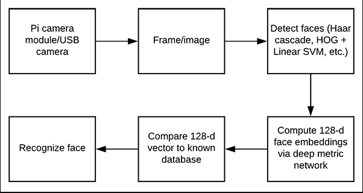

# Object-Tracking-YOLO-V9

Colab Version(old version):
https://colab.research.google.com/drive/1ihPxBq40OfBih9pd8w2_7zBiTBR_889R?usp=sharing

# Steps

## Step 1: Gather your faces dataset
- press k to save images

python build_face_dataset.py --cascade ../models/haarcascade_frontalface_default.xml --output dataset/Mohammed

## Step 2: Compute your face recognition embeddings

python encoding/encode_faces.py --dataset dataset --encodings encoding/encodings.pickle --detection-method hog

## Step 3: run the main

python main.py --cascade models/haarcascade_frontalface_default.xml --encodings encoding/encodings.pickle --output dataset/Mohammed

## if you want to Recognize faces in video streams on your Raspberry Pi only

python pi_face_recognition/pi_face_recognition.py --cascade models/haarcascade_frontalface_default.xml --encodings encoding/encodings.pickle
